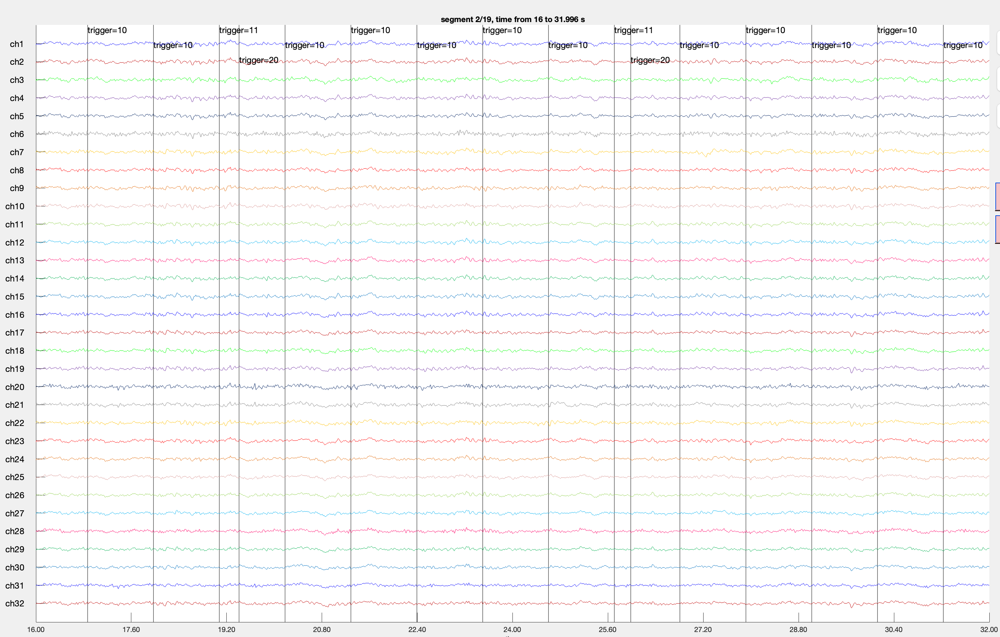

# Loading Mentalab Recordings to FieldTrip

This document provides a simple guide for loading Mentalab Explore device recordings into FieldTrip for ExG analysis and visualization.

## Prerequisites

Before using this guide, you need:
1. A Mentalab Explore device
2. ExplorePy installed and configured
3. MATLAB with FieldTrip toolbox installed
4. The provided `fieldtrip_loader.m` script

## Step 1: Recording Data with Mentalab

Record your EEG data using ExplorePy CLI, Explore Desktop, or Explore Mobile.

## Step 2: Setting Up FieldTrip

1. Download FieldTrip from [fieldtriptoolbox.org](https://www.fieldtriptoolbox.org/download/)
2. Add FieldTrip to your MATLAB path:

```matlab
% Add FieldTrip to your MATLAB path
addpath('/path/to/fieldtrip');  % Replace with your FieldTrip path
ft_defaults;  % Initialize FieldTrip
```

## Step 3: Prepare Your Data Files

After recording, you should have these files in your working directory:
- `my_recording_ExG.csv` - EEG data
- `my_recording_Meta.csv` - Recording metadata
- `my_recording_ORN.csv` - Orientation data
- `my_recording_Marker.csv` - Event markers

In order to load ExG data to FieldTrip we will use `*_ExG.csv` and `*_Meta.csv` files.

## Step 4: Loading and Visualizing Data

### Using the Provided MATLAB Script

Use the included `fieldtrip_loader.m` script:

```matlab
% Run the script
mentalabcsv

% When prompted, enter your ExG CSV filename (e.g., 'my_recording_ExG.csv')

% When prompted, enter your Meta CSV filename (e.g., 'my_recording_Meta.csv')

% When prompted, enter your Marker CSV filename (e.g., 'my_recording_Marker.csv')
```

The script will:
1. Load the CSV data
2. Create a FieldTrip-compatible data structure
3. Display the data using `ft_databrowser`



## References

- [FieldTrip Documentation](https://www.fieldtriptoolbox.org/)
- [ExplorePy Documentation](https://explorepy.readthedocs.io/)
