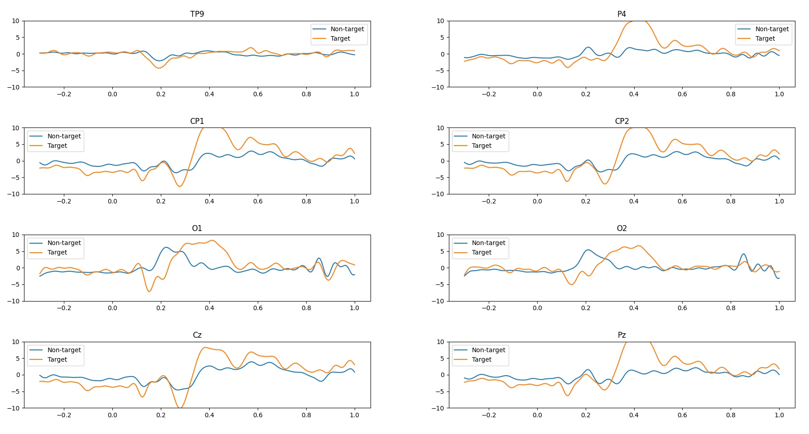

P300 Evoked Potential example project
====================================
This folder contains codes and instructions of a P300 Evoked Potential example project.

Experiment setup
----------------
* Follow the instructions for installing Explorepy in the
[documentation](https://explorepy.readthedocs.io/en/latest/installation.html#how-to-install).
* Activate your Anaconda virtual environment.
* Install required packages by running this command:
`pip install matplotlib psychopy mne`
* In Conda terminal, navigate to `p300_demo` folder in the example directory of the Explorepy's code.
* Setup the cap and electrodes. Place EEG electrodes on the desired positions (e.g. Cz, Pz, CP1, CP2, P4, O1, O2, etc.) and the
ground electrode on Mastoid (or any other location far enough from other electrodes).

Experiment
----------
In this experiment, we implement a simple visual oddball experiment with two visual stimuli,
a blue rectangle and a red oval as the standard and the target stimuli respectively. The following figure illustrates
an example trial presented to the subject. The subject is asked to press the space button whenever the red stimulus is displayed.

Run the experiment by (put the device name and the desired file name in the command):
`python experiment.py -n Explore_#### -f rec_file_name`

Make sure the device is on and in advertising mode before running the command. The experiment has 10 blocks and
there are 5 trials in each block (50 trials in total). The numbers can be changed in `experiment.py` script (`n_blocks` and
`n_trials_per_block` variables).

When the experiment is completed, you will find three csv files (ExG, ORN and markers) in the working directory.

Running `python analysis_csv.py -f rec_file_name` in the terminal will analyse the recorded data and generates the plots.

Results
-------
After running the analysis script, you should have a similar plot containing P300 waveforms.

Feel free to contact support[at]mentalab.com if you have any questions.
