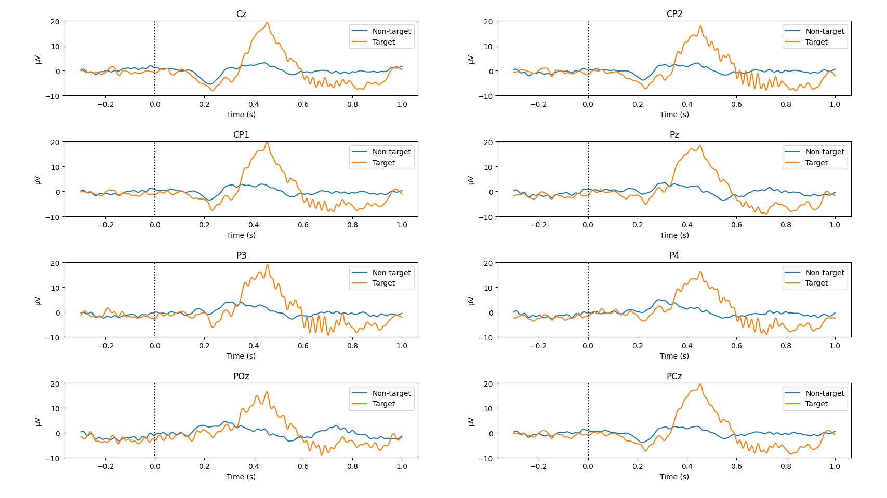

P300 Evoked Potential example project
====================================
This folder contains codes and instructions for a P300 Evoked Potential example project.

Experiment setup
----------------
* Follow the instructions for installing Explorepy in the
[documentation](https://explorepy.readthedocs.io/en/latest/installation.html#how-to-install).
* (Optional) Activate your virtual environment.
* Install the required packages by running the following command:
`pip install matplotlib psychopy mne`
* Download the code from this page.
* In your terminal, navigate to the `p300_demo` folder. Either in the example directory of the Explorepy's code (e.g.
`cd <YOUR-FOLDER>\explorepy-master\examples\p300_demo`) or your chosen location.
* Set up the cap and electrodes. Place the EEG electrodes in the desired positions and the reference electrode on the mastoid or in a location far enough from the other electrodes. In the example, an ear clip electrode was used as the reference.
  * In channel order, 'Cz', 'CP1', 'CP2', 'Pz', 'P3', 'P4', 'CPz', and 'POz' were chosen as electrode positions in the example setup.
  * For any adjustments, refer to the channel-specific Python scripts (i.e., analysis_csv_8_channel.py) and change the chosen locations accordingly.

Experiment
----------
In this experiment, we implement a simple visual oddball experiment with two visual stimuli,
a blue rectangle as the default and a red oval as the target stimuli. The following figure illustrates
an example trial presented to the subject. The subject is asked to press the space button whenever the red stimulus is displayed.

Make sure to be in the correct folder and run the experiment by using the following command:

`python experiment.py -n Explore_#### -f rec_file_name`

Put your device ID and the desired file name in the command.

Make sure the device is on and in advertising mode before running the command. The experiment has 10 blocks and 5 trials in each block (50 trials in total). The numbers can be changed in `experiment.py` script (`n_blocks` and `n_trials_per_block` variables).

| Variable           | Default value |
|--------------------|---------------|
| Stimulus duration  | 500 ms        |
| Number of blocks   | 10            |
| Trials per block   | 5             |
| Sampling rate      | 250           |
| Number of channels | 8 or more     |
| Target marker code | 11            |
|Non-target marker code|10           |

Once the experiment is completed, you will find four csv files (ExG, markers, metadata, and orientation data) in the working directory.

Running the following command in the terminal will analyse the recorded data and generate the plot:\
8 channel: `python analysis_csv_8_channel.py -f rec_file_name`

Results
-------
After running the analysis script, you should have a similar plot containing P300 waveforms for 8-channel devices.

Feel free to contact support[at]mentalab.com if you have any questions.
