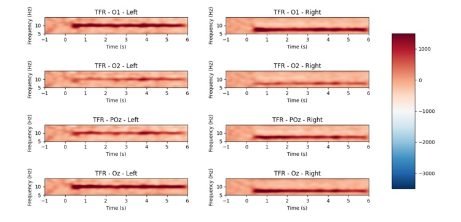

Steady State Visual Evoked Potential (SSVEP) demo
====================================
This folder contains a sample SSVEP project. The experiment has two sections, online SSVEP and offline experiment.


Experiment setup
----------------
* Follow the instructions for installing Explorepy in the
[documentation](https://explorepy.readthedocs.io/en/latest/installation.html#how-to-install).
* Activate your Anaconda virtual environment.
* Install required packages by running this command:
`pip install scikit-learn matplotlib psychopy mne`
* In Conda terminal, navigate to the example folder of the Explorepy's code.
* Setup the cap and electrodes. Place EEG electrodes on the occipital visual cortex (Oz, O1, O2, POz, etc.) and the
ground electrode on Fpz or Mastoid (or any other location far enough from other electrodes).

Online SSVEP
------------
Four flickering stimuli are shown on the screen with the following frequencies (assuming a screen with 60 Hz refresh rate).
* Bottom left: 12 Hz
* Up left: 10 Hz
* Up right: 8.6 Hz
* Bottom right: 7.5 Hz

The predicted target based on subject's real-time EEG is shown in the center.


 Turn on the device and run the following command
in your terminal (replace #### with your device ID e.g Explore_1438).

```
$ python online_ssvep.py --name Explore_#### --duration 100
```

Offline experiment
------------------
In this experiment, we record EEG data while the subject is looking at the specified targets. Then, we run the
offline analysis on the data and compute the accuracy of the system and visualize the Time-Frequency Representations
 (TFR).

After preparing the cap and electrodes, run the following command to start the experiment (replace #### with your device
 ID e.g Explore_1438. `--filename` specifies the recorded file name).

```
$ python offline_experiment.py --name Explore_#### --filename test_rec
```

The experiment runs 100 trials in blocks (numbers can be changed in `offline_experiment.py` by `n_blocks` and
`trials_per_block` variables). At the beginning of each trials a hint is shown to the subject and he/she should focus
on the specified targets throughout the trial.

Once the experiment is done, the recorded data can be analysed by `offline_analysis.py` script. Please give the prefix
of the recorded files (it shouldn't include `_ExG.csv` or `_Marker.csv`). The assumption of the script is that the
electrodes are placed on O1, O2, Oz and POz and the sampling rate of the device is 250 Hz. Otherwise, it can be
changed in the file.

```
$ python offline_analysis.py --filename test_rec
```

Results
-------

The following plot shows the accuracy of the system vs trial length.


Time Frequency Representation of two classes




Feel free to contact support[at]mentalab.com if you have any questions.
